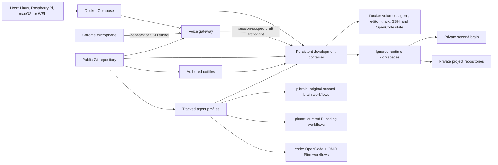

# Portable Agentic Development Environment

My personal, containerized workstation for software development, coding agents, and a durable second brain.

I built this project because I want the same environment on every machine I use: clone the repository, start Docker, and continue working. It combines my terminal and editor configuration with agent profiles, persistent tool state, browser-backed voice dictation, and smoke-tested safety boundaries. Private repositories and knowledge remain in ignored workspaces that I manage explicitly.

It is also an inspectable record of how I approach agentic engineering: I build workflows where agents use tools, retrieve durable context, verify their work, and ask for approval before changing important knowledge.

## What is original and what is adapted

Good agentic work includes knowing when to build and when to adapt. This repository contains both, with provenance kept explicit.

| Component | Purpose | Provenance |
| --- | --- | --- |
| Docker environment and runtime workspaces | Reproduce the workstation while keeping private repositories and knowledge outside the public repository | Designed and developed by me |
| Neovim, tmux, and shell configuration | Provide my portable terminal development workflow | Configured and maintained by me, using third-party tools and plugins |
| Browser-backed voice dictation | Add session-isolated, draft-only voice input to Pi | Designed and developed by me |
| [`pibrain`](agent_profiles/pibrain/) | Operate and learn from a private PARA second brain | Original second-brain workflows developed by me with agent assistance; selected utility skills retained from Matt Pocock with attribution |
| [`pimatt`](agent_profiles/pimatt/) | Provide general software-engineering workflows | Primarily curated from [Matt Pocock's skills](https://github.com/mattpocock/skills), with local integration and explicit attribution |
| [`code`](agent_profiles/code/) | Run OpenCode with oh-my-opencode-slim orchestration | Profile integration and local workflows are tracked here; selected Matt Pocock skills are bundled with attribution |

Skills copied into `pibrain`, `pimatt`, and `code` retain their upstream license, source path, and content hash under the applicable profile.

## Original-work highlight: `pibrain`

`pibrain` is a Pi profile I designed for working with a long-lived private knowledge base without treating every generated statement as truth or silently rewriting established knowledge.

Its skills cover:

- source ingestion with duplicate detection and approval before writes;
- reconciliation of user-confirmed corrections and changed state;
- indexed vault queries with citations and explicit uncertainty;
- safe creation, movement, merging, and archival of primary pages;
- read-only linting before user-selected repairs;
- adaptive learning grounded in confirmed context and evidence.

### Adaptive learning workflow

The [`second-brain-learn`](agent_profiles/pibrain/skills/.agents/skills/second-brain-learn/SKILL.md) skill is based on two ideas:

- the PARA organization method from Tiago Forte's *[Building a Second Brain](https://www.buildingasecondbrain.com/book)*;
- the learning process shown in Eero Alvar's *[How I Use AI to Learn Things](https://www.youtube.com/watch?v=kzcI5F4tGiU)*.

I developed those ideas into a stateful agent workflow that:

1. defines an observable learning goal;
2. retrieves only user-confirmed private context;
3. probes current understanding;
4. builds and verifies a dependency-aware learning path;
5. teaches and adapts based on demonstrated understanding;
6. separates evidence quality from quiz performance;
7. exposes conflicting evidence instead of silently choosing a side;
8. proposes knowledge, learner-state, and teaching-profile updates separately;
9. persists only explicitly approved changes;
10. runs a final read-only vault health check.

This is the kind of agentic work I am interested in: not a single clever prompt, but a bounded process with state, tools, evidence, feedback, and human control.

## Architecture



The public repository contains the environment and workflow definitions. Private knowledge and active project checkouts remain in ignored runtime paths and are never cloned or synchronized automatically. At startup, Graphify installs its Pi integration into the persistent agent volume and its OpenCode skill into the `code` profile.

## Design requirements

- **Portable:** support 64-bit x86 and ARM Docker hosts.
- **Reproducible:** install the same shell, editor, agent, and supporting tools from the Dockerfile.
- **Persistent:** retain generated Pi, Neovim, and tmux state in Docker volumes.
- **Inspectable:** keep authored configuration, skills, and integration code in Git.
- **Private by default:** exclude runtime projects and the second brain from the public repository.
- **Conservative startup:** never clone or synchronize private repositories automatically.
- **Failure tolerant:** keep the core environment usable without provider credentials; report optional services as unconfigured.
- **Human controlled:** require approval before agent workflows persist consequential knowledge changes.

## Quick start

### Prerequisites

- Docker Engine and Docker Compose
- Git

Private-remote access is needed only for repositories you choose to clone into the ignored workspaces.

Start the environment from the repository root:

```sh
docker compose up --build --detach
docker compose exec pi bash
```

The checkout is mounted at `/pi_agent`. Start the appropriate profile inside the container:

```sh
# Pi coding session
cd /pi_agent/workspaces/projects/<repository>
pimatt

# OpenCode coding session
cd /pi_agent/workspaces/projects/<repository>
code

# Second-brain session
cd /pi_agent/workspaces/second_brain
pibrain
```

Stop the environment without deleting persistent volumes:

```sh
docker compose down
```

## Optional local configuration

Copy the example environment file and set only what the current machine needs:

```sh
cp .env.example .env
```

Available settings include provider credentials and Git author identity. `.env` is ignored, and the container starts without provider credentials.

### Voice dictation

Configure `OPENAI_API_KEY` in `.env`, then start Compose:

```sh
cp .env.example .env
# edit .env: set OPENAI_API_KEY
docker compose up --build --detach
```

The gateway binds only to the Docker host's loopback interface. If Chrome runs on that host, open `http://localhost:4317` directly. If Docker runs remotely, forward the port from the machine running Chrome:

```sh
ssh -L 4317:localhost:4317 your-development-host
```

Then open `http://localhost:4317`, grant Chrome microphone permission, and click **Enable microphone**. This only arms the recorder browser. In an interactive Pi session, `Alt+R` and `/voice` are the only recording controls; Pi inserts the transcript into the draft without submitting it. Use `/voice-setup` to select `gpt-4o-mini-transcribe`, `gpt-4o-transcribe`, or `whisper-1` for only that Pi session.

New sessions default to `gpt-4o-mini-transcribe`, English, and a 120-second recording limit. `.env.example` documents `VOICE_GATEWAY_PORT`, `VOICE_TRANSCRIPTION_MODEL`, `VOICE_LANGUAGE`, `VOICE_MAX_DURATION_SECONDS`, and `OPENAI_API_KEY`. Set `VOICE_GATEWAY_PORT` if 4317 conflicts, and use that port in both the browser URL and SSH forwarding command. Invalid values fail before transcription.

#### Voice troubleshooting

| Problem | Fix |
| --- | --- |
| SSH tunnel fails | Confirm SSH access, rerun the forwarding command, and use the configured `VOICE_GATEWAY_PORT`. |
| Port conflict | Set an unused `VOICE_GATEWAY_PORT` in `.env`, restart Compose, and forward that same port. |
| Missing credentials | Set `OPENAI_API_KEY` in `.env` and restart `voice-gateway`; `/health` reports `unconfigured` with the required action while the environment remains usable. |
| Chrome cannot record | Open the forwarded `localhost` page, grant microphone permission, then click **Enable microphone**. |
| Recorder held by another browser | Close its voice page, or use the new page's explicit takeover control once no recording is active. |
| Pi session is stale | Restart the Pi session; it re-registers automatically. Any transcript for the stale session is discarded. |

## Portability and verification

I use this environment on:

- Linux on x86-64;
- Raspberry Pi on 64-bit ARM;
- macOS through Docker;
- Windows through WSL.

The Docker image explicitly supports `amd64` and `arm64`. Run the Linux end-to-end smoke test locally:

```sh
tests/compose-smoke.sh
```

It verifies startup without provider credentials, profile discovery, configuration symlinks, Pi/OpenCode availability, and voice-gateway integration. Voice behavior also has fast unit and syntax checks:

```sh
npm --prefix voice-input test
npm --prefix voice-input run typecheck
```

GitHub Actions currently runs secret scanning; the Compose smoke test remains a local check.

## License and attribution

My original work in this repository is available under the [MIT License](LICENSE). Third-party tools, plugins, and bundled material remain subject to their own licenses.

The skills copied from [`mattpocock/skills`](https://github.com/mattpocock/skills) for `pibrain`, `pimatt`, and `code` retain their MIT license and provenance records under the applicable profile's `LICENSES/` or `skills/LICENSES/` directory and `skills-lock.json` file.
